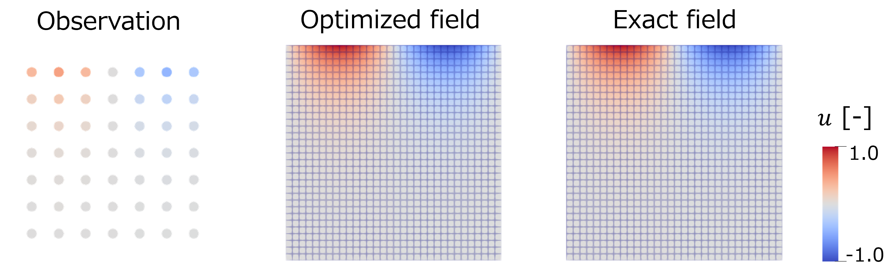

# Example: Poisson Boundary Control

This example estimates an upper-boundary Dirichlet control for a scalar
Poisson problem on the unit square:

```math
\begin{aligned}
-\Delta u &= 0
&& \text{in } \Omega = (0, 1)^2,
\\
u &= m
&& \text{on } \Gamma_{\mathrm{top}},
\\
u &= 0
&& \text{on } \Gamma_{\mathrm{other}}.
\end{aligned}
```

Here, $m$ is the unknown boundary control, $\Gamma_{\mathrm{top}}$ denotes the
top boundary of the unit square, and $\Gamma_{\mathrm{other}}$ denotes the
other boundaries. The control vector contains the Dirichlet values on the top
boundary, excluding the two corner nodes. All other boundary nodes are fixed to
zero.

The target state is generated from

```math
u_{\mathrm{exact}}(x, y) =
\frac{\sin(2\pi x)\sinh(2\pi y)}{\sinh(2\pi)}.
```

The optimization problem minimizes

```math
\min_m
\frac{1}{2}
\sum_{i \in \mathcal{O}}
w_i
\left(u_i(m) - d_i\right)^2
+
\frac{\alpha}{2}
\int_{\Gamma_{\mathrm{top}}} m^2 \, d\Gamma,
```

where $d_i$ are sparse observations and $\alpha$ controls the regularization
strength.

## Optimization setup

The example uses synthetic data so that the optimized result can be checked
directly. First, it samples the exact solution on the controllable top boundary
to define the target control. It then solves the state equation once with that
control to produce the target state.

Only sparse interior observations are used in the objective. By default,
`--obs-stride` is chosen automatically as one eighth of the smaller mesh
dimension. For the documented `32 x 32` run, this gives stride `4`, or
`7 x 7 = 49` observation points.

The regularization term is assembled on the control variables with boundary
quadrature weights, so it discretizes

```math
\frac{\alpha}{2}
\int_{\Gamma_{\mathrm{top}}} m^2 \, d\Gamma.
```

The default regularization weight is `--alpha 1e-6`, and the optimization starts
from the zero control.

The optimizer sees the reduced objective $J(m)$: each trial control is inserted
into the Dirichlet boundary condition, the Poisson state equation is solved,
and the reduced gradient is computed with an adjoint solve. The `poisson-opt-petsc`
executable uses PETSc/TAO for optimization and PETSc linear solvers for the
state and adjoint equations. The `poisson-opt-resolve` executable still uses
PETSc/TAO for optimization, but uses Re::Solve for the state and adjoint linear
solves.

The Poisson residual and state Jacobian are assembled with the backend API:
`Geometry`, `AssemblyMap`, the runtime `ElementView` operator, `BoundaryPlan`,
and `HostCsrMatrix`. A small `MatrixLinearization` adapter copies that planned
CSR Jacobian into PETSc or the Re::Solve map-backed matrix used by the
reduced-functional layer. Both optimization executables assemble and solve on
the CPU.

## Run

From the build directory:

```shell
./examples/poisson-opt/poisson-opt-petsc --nx 32 --ny 32 --output yes --max-its 50
```

The optimization driver uses PETSc/TAO.

With Re::Solve enabled for the forward and adjoint linear solves:

```shell
./examples/poisson-opt/poisson-opt-resolve --nx 32 --ny 32 --output yes --max-its 50
```

## Result

<p align="center">
  
</p>
