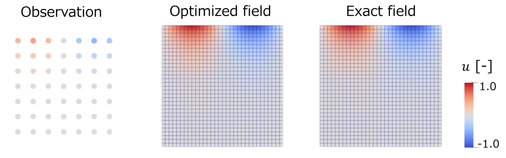

# Example: Poisson Boundary Control

This example estimates a Dirichlet control on the upper boundary of the unit
square:

```math
\begin{aligned}
-\Delta u &= 0 && \text{in } \Omega=(0,1)^2, \\
u &= m && \text{on } \Gamma_{\mathrm{top}}, \\
u &= 0 && \text{on } \Gamma_{\mathrm{other}}.
\end{aligned}
```

The control vector `m` contains the values at the non-corner nodes of the top
boundary. Synthetic observations are generated from

```math
u_{\mathrm{exact}}(x,y)
=
\frac{\sin(2\pi x)\sinh(2\pi y)}{\sinh(2\pi)}.
```

TAO minimizes the reduced objective

```math
\frac{1}{2}\sum_{i\in\mathcal O}
w_i\left(u_i(m)-d_i\right)^2
+
\frac{\alpha}{2}\int_{\Gamma_{\mathrm{top}}}m^2\,d\Gamma.
```

The initial control is zero. `--obs-stride 0` selects an observation spacing
equal to one eighth of the smaller mesh dimension.

## Code layout

The files follow the same flow as the forward Poisson example:

```text
PoissonOptProblem.hpp/.cpp   mesh, FE data, boundary control, observations
PoissonOptResidual.hpp       common residual interface
PoissonOptResidual.cpp       Host assembly and Host parameter VJP
PoissonOptResidual.cu        CUDA assembly and CUDA parameter VJP
PoissonOptSolve.hpp/.cpp     state solve, reduced functional, and TAO
main-resolve.cpp             ReSolve Host/CUDA selection
main-petsc.cpp               distributed PETSc execution
```

`PoissonOptProblem` contains only the mathematical and discretization data.
`HostPoissonOptResidual` and `DevicePoissonOptResidual` implement the same
controlled PDE in different memory spaces. `optimize()` is shared by both
executables, so the sequence visible to a user is always:

```text
make problem -> make residual -> make state solver -> optimize -> report
```

The reduced functional keeps TAO's control vector and the objective on the
Host. Forward assembly, adjoint assembly, linear solves, and the PDE parameter
VJP stay in the selected Host or Device memory space.

When Enzyme is enabled, it differentiates the small boundary-control residual
`u - m`. The Host path invokes Enzyme from C++, and the Device path invokes it
inside a CUDA kernel. Builds without Enzyme use the equivalent analytic
derivative, which keeps the example usable for ordinary ReSolve and PETSc
builds.

## Backends

| Executable | State/adjoint solve | Execution | TAO communicator |
| --- | --- | --- | --- |
| `poisson-opt-resolve` | ReSolve | `--device host` | serial |
| `poisson-opt-resolve` | ReSolve | `--device device` | CUDA |
| `poisson-opt-petsc` | PETSc | Host, distributed assembly | `PETSC_COMM_WORLD` |

TAO is provided by PETSc in all three cases. In an MPI PETSc run, every rank
participates in the TAO callbacks, finite-element assembly, forward solve, and
adjoint solve. Only rank zero prints the report and writes visualization files.

## Build

For one build containing ReSolve Host/CUDA, PETSc/TAO, and Enzyme:

```shell
CXX=clang++ CUDACXX=clang++ \
  cmake --preset resolve-petsc-enzyme \
  -DReSolve_DIR=/path/to/resolve/lib/cmake/resolve \
  -DEnzyme_DIR=/path/to/enzyme/lib/cmake/Enzyme
cmake --build --preset resolve-petsc-enzyme \
  --target poisson-opt-resolve poisson-opt-petsc
```

CUDA Enzyme requires Clang as both the C++ and CUDA compiler. The ordinary
`resolve-petsc` preset builds the same Host/CUDA and TAO paths with the analytic
parameter derivative. The `petsc-enzyme` preset builds the PETSc MPI and Host
Enzyme path without ReSolve.

## Run

ReSolve on the CPU:

```shell
./build/resolve-petsc-enzyme/examples/poisson-opt/poisson-opt-resolve \
  --device host --nx 32 --ny 32 --max-its 50
```

ReSolve and the Enzyme VJP on CUDA:

```shell
./build/resolve-petsc-enzyme/examples/poisson-opt/poisson-opt-resolve \
  --device device --nx 32 --ny 32 --max-its 50
```

PETSc, Enzyme, and TAO on four MPI ranks:

```shell
mpiexec -n 4 \
  ./build/petsc-enzyme/examples/poisson-opt/poisson-opt-petsc \
  --device host --nx 32 --ny 32 --max-its 50
```

Pass `--output yes` to write the final mesh fields and observation point cloud
under the example's build-local `output` directory. Standard PETSc and TAO
options can be added to either executable.

## Result

<p align="center">
  
</p>
